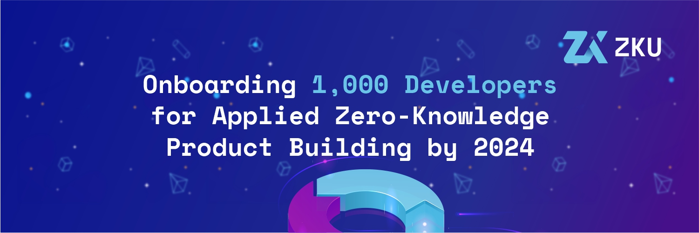

# About ZKU

Zero-Knowledge University was an online course and informal study group, for software developers to learn how to build market-ready products in Web3 using zero-knowledge proof technology. The goal was for developers to launch a ZK app within a couple of months.

<figure><figcaption>
ZKU was funded by Harmony zkDAO back in 2022.
</figcaption></figure>
